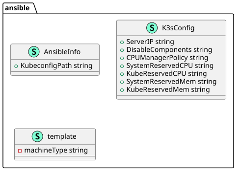
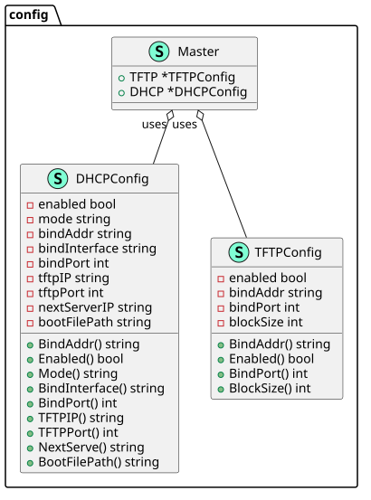
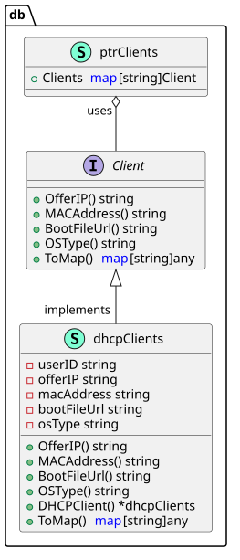
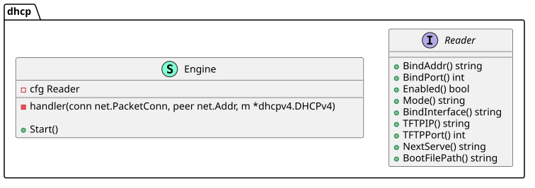
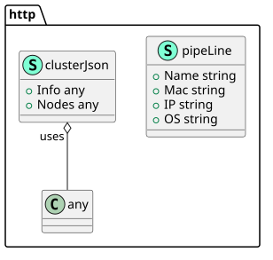
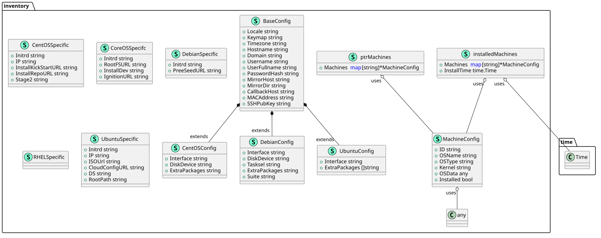
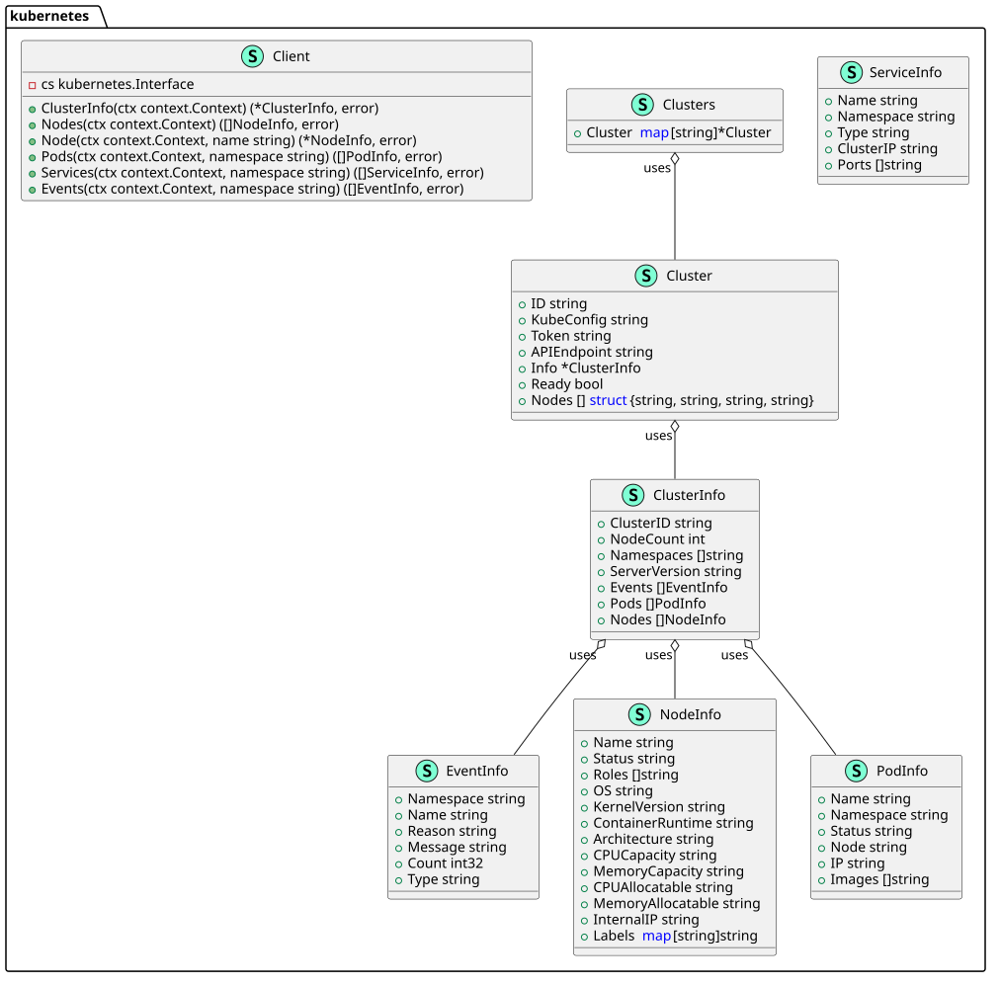

# Package Structure

Generated from internal on 2026-07-28

## ansible

`internal/ansible`

## config

`internal/config`

## db

`internal/db`

## dhcp

`internal/dhcp`

## http

`internal/http`

## inventory

`internal/inventory`

## kubernetes

`internal/kubernetes`

